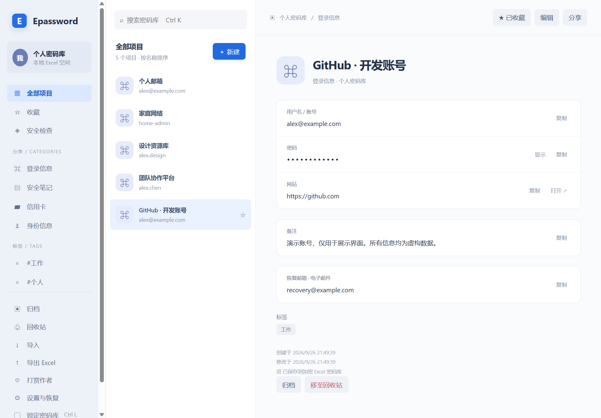
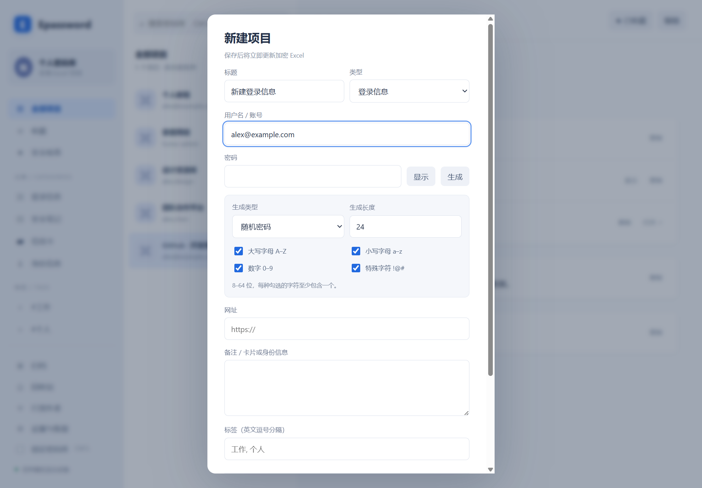
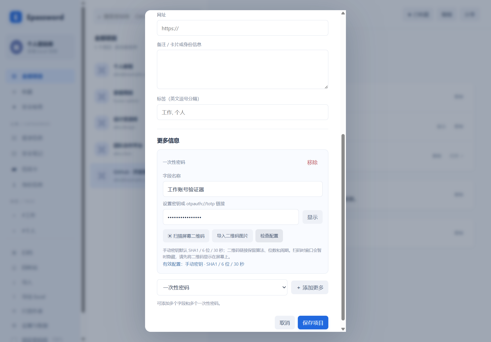

# Epassword

[English](README.en.md) | **简体中文**

[项目 Wiki](docs/wiki/Home-zh-CN.md) · [安装指南](INSTALL.md)

基于 Electron 的本地密码管理器，采用类似 1Password 的三栏布局，用加密 Excel 文件保存密码和 OTP 密钥。**主密码就是 Excel 的文件打开密码**：即使没有 Epassword，也可以使用 Microsoft Excel 读取信息。

Epassword 使用独立品牌，不关联 1Password 服务。已添加 Windows x64、macOS Intel（x64）和 Apple Silicon（arm64）支持。Windows 已实测；Mac 构建入口及自动化流程已准备，尚待 Mac 实机验证。Linux 暂不作为支持目标。

## 下载 1.0

首次公开版本：[Epassword 1.0](https://github.com/EXP-Tools/Epassword/releases/tag/v1.0.0)。推荐一体安装包，同时安装桌面应用与 Chrome 插件文件。

| 平台 | 下载 |
| --- | --- |
| Windows x64 | [Epassword-Setup-1.0.0-win-x64.zip](https://github.com/EXP-Tools/Epassword/releases/download/v1.0.0/Epassword-Setup-1.0.0-win-x64.zip) |
| Mac Intel | [Epassword-Setup-1.0.0-mac-x64.zip](https://github.com/EXP-Tools/Epassword/releases/download/v1.0.0/Epassword-Setup-1.0.0-mac-x64.zip) |
| Mac Apple Silicon | [Epassword-Setup-1.0.0-mac-arm64.zip](https://github.com/EXP-Tools/Epassword/releases/download/v1.0.0/Epassword-Setup-1.0.0-mac-arm64.zip) |

[Chrome 插件](https://github.com/EXP-Tools/Epassword/releases/download/v1.0.0/Epassword-Chrome-1.0.0.zip) · [SHA256SUMS.txt](https://github.com/EXP-Tools/Epassword/releases/download/v1.0.0/SHA256SUMS.txt)

完整解压后，Windows 运行 install.cmd，Mac 运行 bash install.command。Chrome 仍需在扩展管理页手动启用并配对。Mac 包未经 Apple 公证。


## 界面预览与用户手册

[图文用户使用手册](docs/USER-GUIDE.md) · [English user guide](docs/USER-GUIDE.en.md)

以下为真实应用界面，使用虚构演示数据。完整操作步骤、更多截图及常见问题见用户手册。

### 账号管理



### 密码生成



### OTP 与屏幕扫码




## 开始使用

完整安装流程见 **[INSTALL.md](INSTALL.md)**，分别提供人类用户和 AI 的安装、验证、打包与排错步骤。

- 已有 Windows 文件夹版：运行 `release/win-unpacked/Epassword.exe`，请保留整个文件夹。
- 已有 Mac 构建：选择对应芯片架构的 DMG，打开后将 Epassword 拖到“应用程序”。当前工作区没有已构建的 Mac 安装包。
- 只有源码：在项目根目录执行 `npm ci`，然后执行 `npm start`。
- 首次使用：选择“创建密码库”，指定新的 `.xlsx` 文件位置，设置并确认 12–255 个字符的主密码。
- 已有密码库：选择“打开密码库”，选择文件并输入主密码。

应用运行不需要安装 Excel；用 Excel 独立恢复或执行 Excel 兼容测试时才需要它。构建后的应用可以离线使用，首次源码安装需要下载依赖。

## 功能

| 功能 | 支持范围 |
| --- | --- |
| 项目管理 | 登录信息、安全笔记、信用卡、身份信息；新增、编辑、搜索、收藏、标签、归档、回收站恢复 |
| 点击复制 | 点击用户名、隐藏或显示的密码、自定义字段、OTP 即可复制；支持 Enter / 空格 |
| 随机密码 | 8–64 位；可选大小写字母、数字、特殊字符；每种选定字符至少出现一次 |
| PIN | 4–32 位纯数字，默认 6 位，保留前导零 |
| 自定义字段 | 安全问题、文本、URL、电子邮件、地址、日期、一次性密码、密码、电话；每个项目最多 100 个 |
| TOTP | SHA1 / SHA256 / SHA512，6 或 8 位，1–300 秒周期；倒计时、刷新、复制 |
| OTP 导入 | Base32 密钥、`otpauth://totp` 链接、屏幕二维码扫描、二维码图片导入 |
| 本地检查 | 密码长度与重复检查，不查询在线泄露数据库 |
| 锁定 | 5 分钟无操作、系统锁屏或休眠时锁定，也可手动锁定 |
| 文件保护 | 加密备份、保存前外部修改检测、单实例运行 |

信用卡和身份信息可通过备注及自定义字段保存详情。搜索匹配标题、用户名、网址和标签，暂不搜索自定义字段内容。

普通复制内容在 30 秒后清除；OTP 复制内容最多保留至当前周期结束或 30 秒。仅当剪贴板仍为本应用复制的内容时才清除，锁定也会执行清理。

## 日常使用

### 新增与编辑

1. 点击“新建”，填写标题、类型、账号等信息。
2. 选择“随机密码”或“纯数字 PIN 码”，设置长度和字符选项，点击“生成”。
3. 需要额外信息时，在“更多信息”中选择字段类型，点击“添加更多”，填写名称和内容，可重复添加。
4. 点击“保存项目”，写入加密 Excel。生成密码或扫码后仍需要保存才会持久化。

详情页点击内容即可复制；“显示”只切换密码可见性。回收站中的项目可以恢复，其内容仍保存在密码库中。

### 添加 OTP

1. 编辑项目，选择“一次性密码”，点击“添加更多”。
2. 在网站的双重验证设置页显示验证器二维码，点击“扫描屏幕二维码”。Epassword 暂时隐藏，识别后恢复窗口。
3. 也可导入二维码图片，或粘贴 Base32 密钥 / `otpauth://totp` 链接。识别到多个账户时，选择要添加的账户。
4. 点击“检查配置”核对参数，保存项目。详情页显示验证码和剩余秒数，点击即可复制。
5. 按网站提示输入验证码完成双重验证绑定。扫码本身不会替你启用网站的双重验证。

手动密钥默认 SHA1 / 6 位 / 30 秒；非默认参数通过设置链接导入。每个项目可添加多个 OTP。请保持系统时间准确。

屏幕扫描只在点击按钮时执行，在本机内存中识别，不保存、不上传截图。普通网页二维码、HOTP、短信验证码和 Google Authenticator 批量迁移二维码不受支持。

### 快捷键

| 快捷键 | 操作 |
| --- | --- |
| Windows `Ctrl+K` / Mac `⌘K` | 聚焦搜索框 |
| Windows `Ctrl+L` / Mac `⌘L` | 锁定密码库 |
| `Enter` / 空格 | 在可复制字段获得焦点时复制 |
| `Esc` | 关闭弹窗，未保存修改不会写入文件 |

Mac 提供原生菜单和 Command 复制 / 粘贴。关闭窗口会锁定密码库，但应用保留在 Dock；点击 Dock 图标重新打开解锁页，`⌘Q` 完全退出。Windows 关闭最后一个窗口则退出应用。

Mac 屏幕扫码需要系统录屏权限。可在 OTP 编辑区点击“屏幕录制权限设置”，授权后退出并重新启动应用。图片导入不需要录屏权限。

## Excel 独立恢复

文件使用 Office ECMA-376 Agile 原生文件加密，不是工作表保护，也不是在单元格中存放应用私有密文。没有额外的应用恢复密钥。

| 工作表 | 内容 |
| --- | --- |
| 密码库 | 标题、类型、用户名、密码、网址、备注、标签、状态及时间 |
| 自定义字段 | 项目 ID、字段 ID、类型、名称、内容；包含 OTP 设置密钥或链接 |
| 使用说明 | 文件格式和恢复说明 |

恢复步骤：

1. 用 Microsoft Excel 打开保存的 `.xlsx`，输入同一个主密码。
2. 在“密码库”表读取账号和密码；在“自定义字段”表按项目 ID 查找额外信息。
3. OTP 字段保存的是长期设置密钥或链接，可重新导入兼容验证器。Excel 能读取恢复材料，但不会自动生成实时验证码。

### 备份与兼容性

- 每次保存会在原文件旁保留 `.xlsx.bak`，它是前一次保存的加密文件，不是多版本历史。复制并改名为新的 `.xlsx` 后即可打开。
- 修改主密码后，上一份备份仍使用旧密码。请另行备份重要的 `.xlsx`；同目录 `.bak` 不能替代异地备份。
- 旧格式文件可打开，首次保存自动增加自定义字段表。添加新字段后，不要用旧版 Epassword 重写文件，以免丢失新字段。
- 不要同时在 Excel 和 Epassword 中编辑。遇到外部修改提示，锁定后重新打开以加载外部修改。
- 用 Excel 编辑时保留表头、ID 和数据结构。应用重写文件不会保留自行添加的其他工作表及格式，也不支持数据表中的公式单元格。

**忘记主密码无法重置或恢复；密码库文件丢失仍需要备份。**

## 开发与验证

项目固定 Electron 41.10.7，使用 ExcelJS、officecrypto-tool、jsQR 和 Node.js 密码学 API。

```powershell
npm ci
npm test
npm start
```

| 命令 | 用途 |
| --- | --- |
| `npm test` | 存储、密码生成、OTP 标准向量、二维码及字段恢复测试 |
| `npm run test:desktop` | 基础桌面交互测试 |
| `node tests/copy-generator.cjs` | 点击复制、随机密码和 PIN 测试 |
| `node tests/otp-desktop.cjs` | 自定义字段、图片导入、真实屏幕扫码及 OTP 桌面测试 |
| `npm run test:platform` | 原生平台启动、快捷键、锁定；Mac 还验证菜单和 Dock 重开 |
| `npm run pack` | 构建当前系统、当前架构的应用目录 |
| `npm run dist:win` | 在 Windows 上构建 x64 portable EXE |
| `npm run dist:mac:arm64` | 在 Mac 上构建 Apple Silicon DMG / ZIP |
| `npm run dist:mac:x64` | 在 Mac 上构建 Intel DMG / ZIP |
| `npm run dist` | 构建当前系统和当前架构的分发包 |

桌面测试会打开窗口并操作测试剪贴板；Excel 测试依赖桌面测试先生成的文件。具体顺序和前置条件见 [INSTALL.md](INSTALL.md)。

已有验证记录：Windows 打包程序交互测试通过；TOTP 通过 RFC 6238 的 18 个标准测试向量；本机 Microsoft Excel 可直接读出密码、中文内容及 OTP 恢复链接。这些记录不等同于所有平台兼容性或独立安全审计。

Windows 和 Mac 使用同一 Excel 数据格式、同一主密码；手动复制密码库即可在另一台设备打开，没有自动同步。不要在两台设备同时修改同一文件。

已提供 [GitHub Actions 构建流程](.github/workflows/build.yml)，分别使用 Windows、Mac Intel、Mac ARM runner 执行测试和打包，仅上传工作流产物，不自动发布 Release。Mac 默认产物为本地 ad-hoc 签名测试包；公开分发所需的 Developer ID 签名与 Apple 公证见 [INSTALL.md](INSTALL.md)。构建状态请以仓库 Actions 记录为准。

## 项目结构

```text
electron/       主进程、IPC、Excel 加密存储、密码生成、OTP 与二维码识别
ui/             本地界面、样式、自定义字段和 OTP 展示
scripts/        打包脚本
tests/          自动化及 Excel 兼容测试
release/        构建产物，不纳入版本控制
test-results/   测试文件及截图，不纳入版本控制
start.cmd       Windows 源码启动入口，需先安装依赖
start.command   Mac 源码启动入口，需先安装依赖
build/          Mac 签名权限配置
.github/        Windows / Mac 双架构 CI 构建流程
```

## 当前边界

尚无云同步、附件、共享、通行密钥或在线泄露服务。未经过独立安全审计，不宣称与 1Password 同等安全保证。

渲染器关闭 Node 集成，启用上下文隔离和 sandbox，不加载远程内容。解锁期间凭据存在应用内存中，不写入应用日志或浏览器本地存储；JavaScript 字符串和系统剪贴板历史无法保证物理擦除。可选插件的配对凭据与待保存注册信息暂存在浏览器会话内存中。点击网址会交给系统默认浏览器打开。

## 参考

- [1Password 侧栏交互](https://support.1password.com/sidebar/)
- [Office 加密实现](https://github.com/zurmokeeper/officecrypto-tool)
- [TOTP：RFC 6238](https://www.rfc-editor.org/rfc/rfc6238)
- [OTP 设置链接格式](https://github.com/google/google-authenticator/wiki/Key-Uri-Format)
- [jsQR 本地二维码识别](https://github.com/cozmo/jsQR)

## Chrome 浏览器插件

支持精确匹配 HTTPS 网站的账号填充、单账号可选自动填充，以及注册信息检测后确认保存到 Excel。桌面端必须运行且已解锁，Windows / Mac 使用同一插件。

Chrome 开发者模式加载 extension 文件夹，再在桌面端设置中生成配对码并粘贴到插件。重启任一应用后重新配对。参见[完整安装与限制](docs/wiki/Browser-Extension-zh-CN.md)，使用 npm run pack:extension 生成 ZIP。

## 桌面与插件一体安装

从 [Release 1.0](https://github.com/EXP-Tools/Epassword/releases/tag/v1.0.0) 下载对应平台的 Epassword-Setup ZIP，完整解压后运行 install.cmd（Windows）或 bash install.command（Mac）。安装包自带运行时，无需 Node.js，同时安装桌面程序与插件文件，再按指引在 Chrome 中启用并配对。[安装说明](INSTALL.md)。

## AI 与程序 API

支持独立、限时、限网站的本机程序授权，查询匹配账号并读取指定凭据用于填充。锁定密码库立即撤销 API Token。附带 Playwright 填充助手，只向调用者返回填充状态。[中文 API 文档](docs/API.zh-CN.md) · [OpenAPI](docs/openapi.json)。

## 记住密码库路径

桌面应用会记住本机最后一次成功打开或创建的密码库路径，重启后输入主密码即可解锁，不保存主密码。文件移动后，可点击文件选择框重新定位。

## 打赏作者

桌面侧栏与 Chrome 插件弹窗均提供 **打赏作者** 菜单，显示支付宝收款码和微信赞赏码。图片随应用打包，可离线查看，打赏完全自愿。

## 导入与导出 Excel

新版源码支持多选/全选项目导出，选择普通 Excel 或使用独立主密码加密。导入支持预览并选择 Epassword 格式项目，追加为新项目，保留自定义字段及 OTP。[图文操作说明](docs/USER-GUIDE.md)。已发布的 1.0 安装包不含此新增功能，请使用最新构建。
