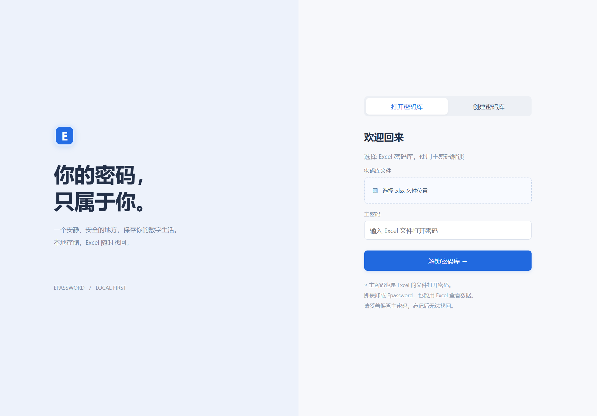
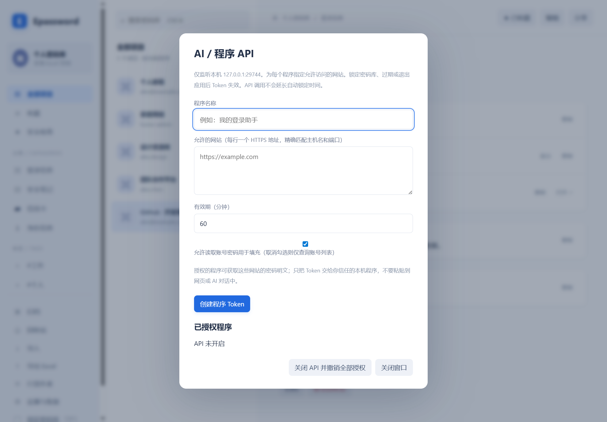
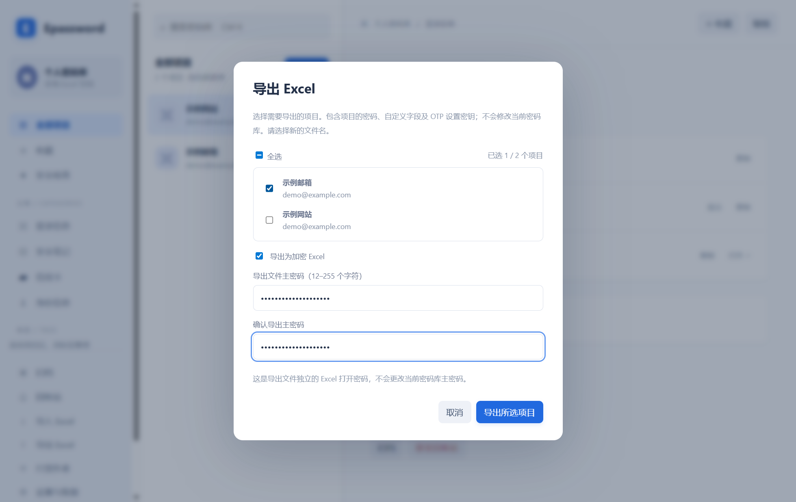
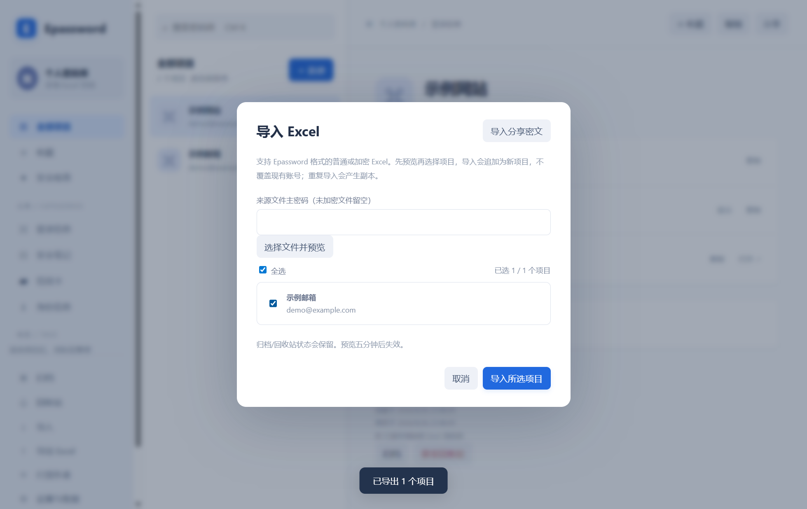
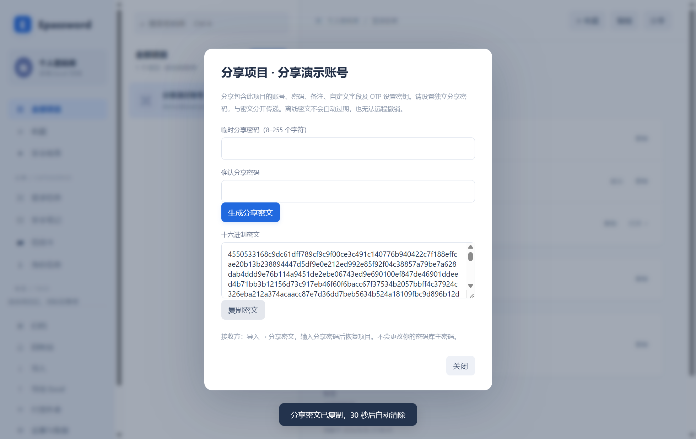
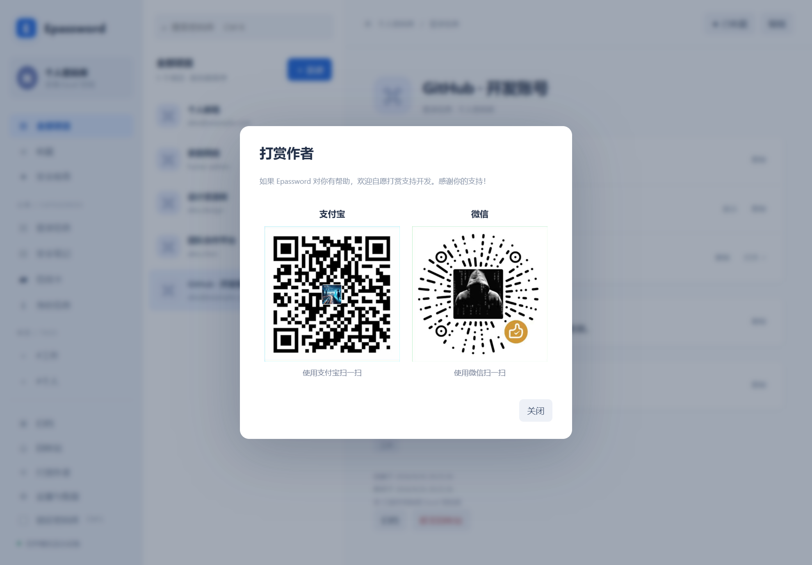

# Epassword user guide

[简体中文](USER-GUIDE.md) | **English** · [README](../README.en.md) · [Installation](../INSTALL.en.md)

For Epassword 1.2. These are real Electron screenshots captured on Windows with fictional accounts and OTP configuration. The UI is currently Chinese. On Mac, use Command instead of Ctrl. Click an image to enlarge it.

## 1. Install and open

Download the matching Epassword-Setup ZIP from [Release 1.2](https://github.com/EXP-Tools/Epassword/releases/tag/v1.2.0). Extract everything, then run install.cmd on Windows or bash install.command on Mac. Choose x64 for Intel Macs and arm64 for Apple Silicon. Mac packages are not notarized. See [installation instructions](../INSTALL.en.md) for requirements.

The combined installer includes desktop, Chrome extension files and the API client. Chrome still requires manual activation and pairing.

## 2. Create, open and lock a vault

1. Select 创建密码库 (Create vault).
2. Choose a new .xlsx location outside the application installation folder.
3. Enter and confirm a 8–255 character master password.
4. Click 创建密码库.

For an existing Epassword workbook, select 打开密码库 (Open vault), choose the file and enter its master password. The last successfully opened or created path is remembered; the password is not. Click the file selector again if the file moves. Create mode clears the selection; returning to Open restores the recent path.

The master password is also the Excel file-open password. It cannot be recovered if forgotten. Lock with 锁定密码库 or Ctrl+L / ⌘L. Five minutes of inactivity, sleep or system locking also locks the vault. On Mac, closing a window can leave the app in the Dock; ⌘Q exits.

## 3. Save, find and copy an account

Use the left sidebar for categories, favorites, tags, archive and trash. Select an item in the middle to view its details.

Click ＋ 新建, choose 登录信息 (Login), then enter a title, username, password and full website URL. Add notes and comma-separated tags if needed. Scroll to the bottom and click 保存项目 to write the encrypted workbook.

Click a username/password field or its 复制 button to copy. 显示 reveals the password temporarily. Copied passwords clear after about 30 seconds if the clipboard still contains the value copied by Epassword; OTP clearing is also limited by its remaining lifetime.

Ctrl+K / ⌘K searches titles, usernames, websites and tags. 编辑 edits, 收藏 favorites. Archived/deleted entries are excluded from ordinary lists and browser matching; use the respective sidebar view to restore them. 安全检查 checks short/reused passwords, not online breaches.

## 4. Generate passwords and add fields

Choose the generator type and length, then click 生成 beside the password.

| Type | Options |
| --- | --- |
| 随机密码 — Random password | 8–64 characters; uppercase, lowercase, digits and symbols; each selected group occurs |
| 纯数字 PIN 码 — Numeric PIN | 4–32 digits, default 6; leading zeros preserved |

Save the item afterward. Generating a local password does not change the account password on its website.

Scroll to 更多信息 (More information), select a type and click ＋ 添加更多. Supported fields include security questions, text, URL, email, address, date, OTP, password and phone. Multiple fields are allowed. Extra URL fields can represent other legitimate login origins for the same account.

## 5. Add an authenticator OTP

1. Enable authenticator-based two-factor authentication on the website and display its setup QR code.
2. Edit the Epassword item, scroll to 更多信息, select 一次性密码 and click ＋ 添加更多.
3. Click 扫描屏幕二维码 (Scan screen). The window briefly hides. Select the intended account if multiple configurations are detected.
4. Alternatively, choose 导入二维码图片 (Import image), or paste the setup secret / otpauth://totp URI.
5. Click 检查配置 to validate, then 保存项目 at the bottom.
6. Copy the current code from the item details to complete enrollment on the website.

Raw secrets default to SHA1 / 6 digits / 30 seconds; URIs preserve their parameters. This supports TOTP setup codes, not arbitrary QR codes. Mac requires screen-recording permission for screen scanning. Enlarge the QR or import an image if scanning fails. Check the system clock if codes are rejected, and retain the website's recovery codes.

## 6. Chrome filling and registration saving

1. Open chrome://extensions, enable Developer mode, choose Load unpacked and select the permanent chrome-extension folder shown by the installer.
2. Pin Epassword and refresh pages opened before installation.
3. Unlock the desktop app. In 设置与恢复 → 浏览器插件, click 生成配对码.
4. Copy the selected code. On an HTTPS page, open the extension, expand 连接桌面端, paste the code and choose 配对. Do not enter your master password.

Click a matching account to fill. Optional single-account autofill works only when one account matches and inputs are not already populated. It does not submit forms. Matching requires an exact HTTPS hostname and port; subdomains do not inherit access. The vault must be unlocked.

HTTP, iframes, new-password forms and some custom/multistep pages cannot be filled. Copy from the desktop app when needed.

After a registration prompt, first confirm registration succeeded. Choose 保存到 Epassword in the extension and 保存新项目 in the desktop confirmation dialog. This adds an item without overwriting existing accounts. Detection cannot cover every registration page.

Pair again after restarting either app or browser. Reload the extension after upgrading. See the [extension guide](wiki/Browser-Extension.md) for details.

## 7. Authorize a local AI tool or program

Open 设置与恢复 → AI / 其他程序 → 管理程序 API 授权. Enter a program name, exact allowed HTTPS sites and expiry. Disable password-reading permission if only account listings are needed.

Create the token and supply it only to a trusted local program, outside AI conversations and logs. It is neither the master password nor a browser pairing code. Locking, changing the master password or quitting revokes tokens. API calls do not extend idle-lock time.

This connects local automation tools; it is not a built-in AI chat. See the [API guide](API.md) for requests and Playwright filling.

## Import and export Excel (new in 1.1)

Import/export is included in the 1.1 installers.

### Export selected items

1. Unlock the vault and choose 导出 Excel in the sidebar.
2. Select individual items or 全选 (Select all). Archived/trash entries are included and labeled.
3. Encryption is enabled by default. Enter and confirm a separate 8–255 character password for the exported file. This does not change the current vault password.
4. Disable encryption for a plain workbook. Anyone with access can read passwords, notes and OTP setup secrets.
5. Choose 导出所选项目 and a new filename. Existing files are never overwritten.

Exports include custom fields and OTP setup configuration, not just expiring codes. Encrypted exports open in Excel with the export password and can also be opened as Epassword vaults. Plain exports must use the import flow; the working vault remains encrypted.

### Preview and import

Unlock the destination vault, choose 导入 Excel, enter the source password if encrypted (otherwise leave blank), and choose 选择文件并预览. Select an Epassword workbook/export, choose the desired entries or select all, then click 导入所选项目.

Only Epassword's worksheet/column format is supported, not arbitrary Excel/CSV. Source files are limited to 20 MB; the destination allows 10000 items total. Preview expires after five minutes or locking.

Import appends new IDs without overwriting accounts, preserving custom fields, OTP and archive/trash state. Repeated imports create copies. Imported items are encrypted under the destination vault's existing master password.

## Share one item (new in 1.2)

Both sender and recipient need Epassword 1.2 or newer.

### Sender: generate and copy

Select an item and click 分享 (Share). Set and confirm an independent 8–255 character sharing password, click 生成分享密文, then 复制密文. Send the hexadecimal string and communicate the password separately; never send the vault master password.

### Recipient: decrypt and import

1. Unlock your destination vault.
2. Choose 导入 in the sidebar, then 切换到分享导入 at the top right of the dialog.
3. Paste the complete hexadecimal string and enter the sender’s sharing password, not your vault master password.
4. Choose 解密并预览 and check the title and account.
5. Choose 导入此项目. The new item is appended with a fresh ID and saved under your own vault encryption.

Existing accounts are not overwritten; repeated imports create copies. If the shared item was archived or in trash, look in the corresponding sidebar view.

### Troubleshooting

- Wrong password or damaged ciphertext: confirm the sharing password and copy the complete string again. Letter case and whitespace/newlines are accepted.
- Unsupported format: use ciphertext generated by Epassword Share, not plaintext JSON, Excel contents or another application’s format.
- Expired preview: after five minutes or vault locking, enter the password and decrypt again.
- Forgotten sharing password: the sender can generate a new share from the original item using a new password. The recipient cannot recover the old sharing password.

The payload includes passwords, notes, custom fields and OTP setup secrets, preserving favorite/archive/trash state. Wrong passwords or tampered ciphertext are rejected. “Temporary” means a password dedicated to this share: **offline ciphertext has no automatic expiry or remote revocation**. Later password changes do not invalidate an existing share.

JSON is encrypted with AES-256-GCM and a scrypt-derived key, with a random salt and nonce for every share. See the [format specification](SHARING.md). The copied ciphertext clears after about 30 seconds if it is still the clipboard value.

## 8. Backup and Excel recovery

设置与恢复 displays the current file; 在文件夹中显示 opens its folder.

- Back up the .xlsx after locking/closing the app. The neighboring .bak contains the previous encrypted save, not full version history.
- To move computers, copy the workbook and open it with the same master password. There is no automatic cloud sync; avoid concurrent editing.
- Without Epassword, open the workbook in Microsoft Excel with the master password and read the 密码库 worksheet.
- To recover a backup, preserve the current file, copy the .bak and rename the copy to .xlsx.
- Change the master password in 设置与恢复 using the current password plus the new password and confirmation. Older backups still use the old password.

Excel recovery is intended for reading data. Changing the worksheet structure may prevent Epassword from recognizing it.

## 9. Support the author

Choose 打赏作者 in the desktop sidebar or extension and scan with Alipay or WeChat. Donations are optional; images are bundled for offline display.

## 10. Troubleshooting

| Problem | What to check |
| --- | --- |
| Remembered file cannot open | File moved, disk disconnected or permissions changed; select it again |
| Master password rejected | Input method/case; older backups may require the older password |
| External modification detected | Preserve file/backups, stop other editors, reopen and review |
| No browser accounts | Exact HTTPS origin, pairing, login category, archive/trash state |
| Cannot find extra fields or Save | Scroll inside the editor dialog |
| OTP scan fails | QR size, screen permission, or import the image |
| API authorization expired | Unlock if needed and authorize again |

To regenerate screenshots, run node scripts/capture-screenshots.cjs in an isolated development environment. It uses a fictional workbook and profile under test-results.
