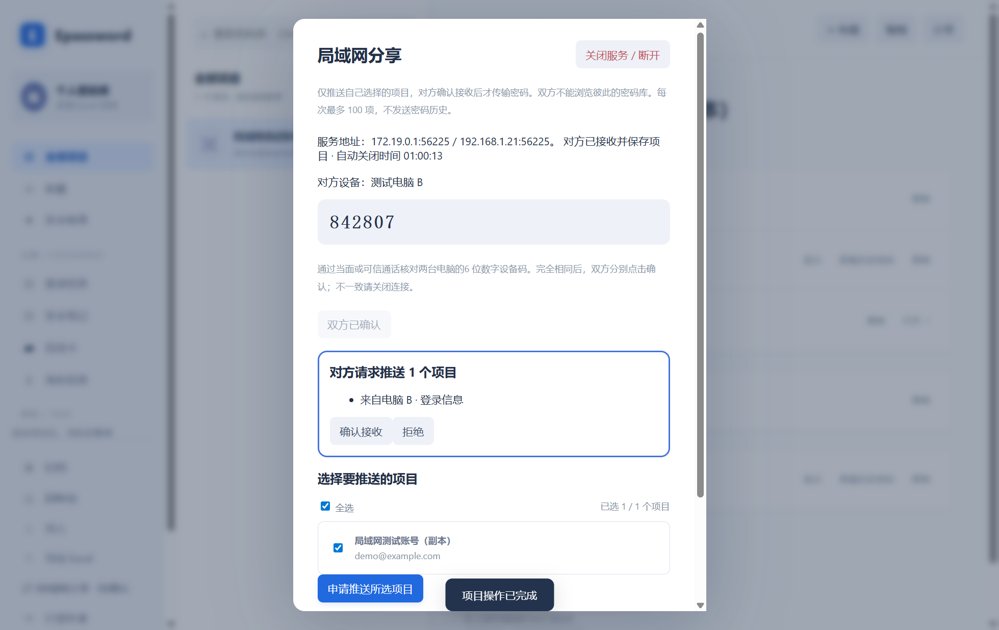
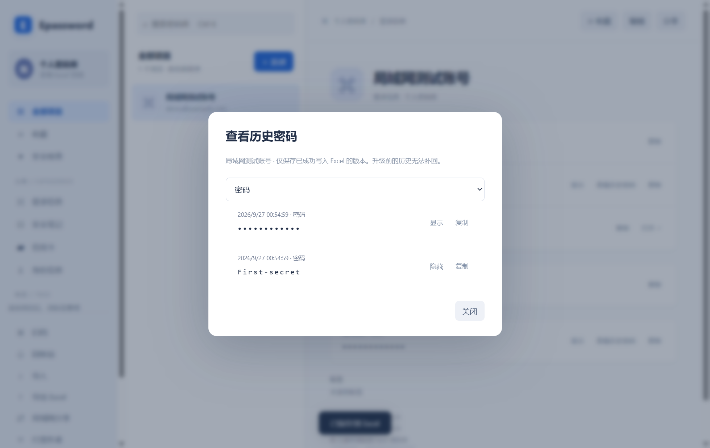

# Epassword 用户使用手册

**简体中文** | [English](USER-GUIDE.en.md) · [返回 README](../README.md) · [安装指南](../INSTALL.md)

适用于 Epassword 1.2。界面截图来自 Windows 上运行的真实 Electron 应用，账号、邮箱、密码和 OTP 配置均为虚构示例。Mac 的主要操作相同，快捷键使用 Command 替代 Ctrl。点击图片可查看大图。

## 1. 安装并启动

从 [Release 1.2](https://github.com/EXP-Tools/Epassword/releases/tag/v1.2.0) 下载与你的系统对应的 **Epassword-Setup** ZIP，完整解压。Windows 运行 **install.cmd**，Mac 运行 **bash install.command**。安装器同时复制桌面应用、插件文件及 API 客户端；Chrome 插件仍需手动启用，见第 6 节。

Mac Intel 选 x64，Apple Silicon 选 arm64。Mac 包未经过 Apple 公证；详细要求和安装排错见[安装指南](../INSTALL.md)。

## 2. 创建、打开和锁定密码库

第一次使用：

1. 点击「创建密码库」。
2. 点击文件选择框，选择新的 .xlsx 保存位置。把密码库放在安装目录之外。
3. 设置并确认主密码，长度为 8–255 个字符。
4. 点击「创建密码库」，进入主界面。

已有密码库时，选择「打开密码库」，选择 Epassword 创建的 Excel 文件并输入主密码。应用会记住最后一次成功打开或创建的文件路径，下次只需输入主密码；不会记住主密码。文件被移动时，点击文件选择框重新定位。

主密码也是 Excel 的文件打开密码，忘记后无法找回。切换到「创建密码库」会清空当前选择的位置，切回「打开密码库」恢复最近路径。

离开电脑前点击侧栏「锁定密码库」，或按 **Ctrl+L / ⌘L**。五分钟无操作、系统锁屏或休眠也会锁定。Mac 关闭窗口后应用可能仍在 Dock，点击 Dock 图标重新打开解锁页；⌘Q 完全退出。

## 3. 保存、查找和复制账号

左侧切换分类、收藏、标签、归档和回收站，中间选择项目，右侧查看详情。

1. 点击「＋ 新建」，选择「登录信息」。
2. 输入标题、用户名、密码和完整网址，如 https://github.com。
3. 需要时填写备注、以英文逗号分隔的标签。
4. 滚动到表单底部，点击「保存项目」，立即写入加密 Excel。

点击用户名或密码字段本身，或旁边的「复制」，即可复制；密码旁的「显示」用于临时查看。复制的密码约 30 秒后清除，前提是剪贴板内容仍为应用复制的值。OTP 的清除时间还受剩余有效期限制。

按 **Ctrl+K / ⌘K** 搜索标题、用户名、网址或标签。点击「编辑」修改项目，「收藏」便于快速查找。归档和移至回收站会让项目退出普通列表及插件匹配；进入对应侧栏可取消归档或恢复。

「安全检查」展示较短或重复使用的密码，不代表在线泄露检测。

## 4. 生成密码与添加更多信息

在新建或编辑窗口中，先选择生成类型和长度，再点击密码右侧「生成」：

| 类型 | 配置 |
| --- | --- |
| 随机密码 | 8–64 位；选择大写、小写、数字、特殊字符，每种选中的字符至少出现一次 |
| 纯数字 PIN 码 | 4–32 位，默认 6 位，保留前导零 |

生成后点击「保存项目」才会保存到密码库。为已存在的网站账号生成新密码，只会修改本地条目；仍需在网站上完成改密。

向下滚动到「更多信息」，从下拉框选择安全问题、文本、URL、电子邮件、地址、日期、一次性密码、密码或电话，然后点击「＋ 添加更多」。填写字段名称和内容，同一项目可添加多个字段。额外 URL 可用于补充同一账号的其他合法登录域名。

## 5. OTP：扫码添加一次性密码

1. 在网站上开启验证器两步验证，让网站的验证器设置二维码显示在屏幕上。
2. 在 Epassword 编辑项目，滚动到「更多信息」，选择「一次性密码」并点击「＋ 添加更多」。
3. 点击「扫描屏幕二维码」。应用会暂时隐藏以读取屏幕；若识别出多个配置，选择目标账号。
4. 也可点击「导入二维码图片」，或手动粘贴设置密钥、otpauth://totp 链接。
5. 点击「检查配置」，确认算法、位数与周期，再点击底部「保存项目」。
6. 回到项目详情，复制当前验证码，在网站完成验证器绑定。之后点击验证码即可复制。

手动密钥默认 SHA1、6 位、30 秒；链接保留其中指定的参数。这里支持 TOTP 验证器配置，不会把任意网页二维码转为 OTP。Mac 扫描屏幕需要屏幕录制权限；识别失败可放大二维码或改用图片导入。验证码无效时先检查系统时间与网站配置，并妥善保存网站提供的恢复码。

## 6. Chrome 插件：填充与注册保存

首次连接：

1. Chrome 打开 chrome://extensions，开启「开发者模式」，点击「加载已解压的扩展程序」，选择安装指引显示的 chrome-extension 文件夹。
2. 固定插件到工具栏；若网页在安装前已打开，刷新网页。
3. 桌面应用解锁后，进入「设置与恢复 → 浏览器插件」，点击「生成配对码」。
4. 复制选中的配对码，打开 HTTPS 网站，在插件的「连接桌面端」中粘贴并点击「配对」。不要填写主密码。

插件显示当前网站匹配的账号，点击账号即可填充；勾选「此网站单账号自动填充」后，仅在只有一个匹配账号且输入未被占用时自动填充。填充不提交登录表单。

匹配要求 HTTPS 域名与端口一致；子域名不自动继承。密码库必须已解锁。HTTP、iframe、新密码表单和部分分步登录或自定义控件不支持填充，可回到桌面端复制。

注册时出现保存提示后，先确认网站注册成功，再在插件点击「保存到 Epassword」，并在桌面弹出的确认框选择「保存新项目」。这会新增项目，不覆盖旧账号。不是所有注册页面都能识别，必要时手动新增。

重启应用或浏览器后重新配对；升级插件后在扩展管理页点击「重新加载」。更多限制与排错见[插件指南](wiki/Browser-Extension-zh-CN.md)。

## 7. 授权 AI 或其他本机程序

进入「设置与恢复 → AI / 其他程序 → 管理程序 API 授权」。填写程序名称、允许的完整 HTTPS 网站和有效期；只需查询账号列表时取消读取密码权限。

点击「创建程序 Token」后，将 Token 交给受信任的本机程序，不要放入 AI 对话或日志。它不是主密码，也不是浏览器配对码。锁定、修改主密码或退出应用会撤销授权，API 调用不会延长自动锁定时间。

AI 接入由本地工具完成，并非在应用中直接聊天。请求示例与 Playwright 填充方法见 [API 文档](API.zh-CN.md)。

## 导入与导出 Excel（1.1 新增）

从 1.1 起，一体安装包包含导入导出功能。

### 导出选中的项目

1. 解锁密码库，点击侧栏「导出 Excel」。
2. 勾选多个项目，或使用「全选」。列表包括归档和回收站项目，并显示对应状态。
3. 默认勾选「导出为加密 Excel」。为导出文件设置独立的 8–255 字符主密码，并再次确认；此密码不会改变当前密码库主密码。
4. 如需普通 Excel，取消加密选项。普通文件中的密码、备注和 OTP 设置密钥可直接读取。
5. 点击「导出所选项目」，选择新文件名。为避免覆盖现有密码库，导出不覆盖已存在的文件。

导出包含所选项目的自定义字段和 OTP 设置配置，不是仅导出当前验证码。加密导出可直接由 Microsoft Excel 使用新设置的主密码打开，也可作为 Epassword 密码库打开；普通导出通过下述导入流程使用，不能直接作为未加密工作密码库打开。

### 预览并导入

1. 解锁目标密码库，点击「导入 Excel」。
2. 若来源已加密，先输入来源文件的主密码；普通 Excel 留空。
3. 点击「选择文件并预览」，选择 Epassword 导出的 .xlsx 或已有 Epassword 密码库。
4. 在预览中勾选要导入的项目，也可全选，再点击「导入所选项目」。

仅支持 Epassword 的工作表及字段结构，不能直接导入任意 Excel/CSV 表格。文件上限 20 MB，目标密码库合计最多 10000 项。预览五分钟后失效，锁定后需重新预览。

导入保留自定义字段、OTP 和归档/回收站状态，以新 ID 追加项目，不覆盖已有账号；重复导入会产生副本。导入后的数据仍使用目标密码库原来的主密码加密。

## 分享单个项目（1.2 新增）

发送方与接收方均需使用 Epassword 1.2 或更新版本。

### 发送方：生成并复制密文

1. 在项目详情右上角点击「分享」。
2. 设置并确认独立的临时分享密码（8–255 个字符）。
3. 点击「生成分享密文」，再点击「复制密文」，把十六进制字符串发送给接收方。
4. 将分享密码通过单独渠道告知对方，不需要提供密码库主密码。

### 接收方：解密并导入

1. 解锁自己的目标密码库。
2. 点击侧栏「导入」，在弹窗右上角点击「切换到分享导入」。
3. 粘贴收到的完整十六进制字符串，输入发送方设置的分享密码，而不是自己的密码库主密码。
4. 点击「解密并预览」，检查显示的标题和账号。
5. 点击「导入此项目」。项目会以新 ID 追加到当前密码库，并由当前密码库的主密码加密保存。

恢复为新项目，不覆盖原有账号，重复导入会产生副本。若恢复的项目原本位于归档或回收站，请在对应侧栏查找。

### 分享失败时如何处理

- **密码错误或密文损坏：** 向发送方核对分享密码，重新复制完整密文；不要漏掉开头或结尾。大小写和空白换行可以接受。
- **不支持的格式：** 使用 Epassword「分享」生成的密文，不是 JSON 明文、Excel 文件内容或其他软件的加密串。
- **预览失效：** 五分钟后或密码库锁定后，重新输入密码并解密预览。
- **分享密码忘记：** 发送方重新打开原项目，用新分享密码重新生成密文；接收方无法恢复旧分享密码。

分享包含项目的密码、备注、自定义字段和 OTP 设置密钥，保留收藏、归档和回收站状态。修改密文或使用错误密码不能解密。临时密码只表示本次分享独立使用，**离线密文不会自动过期，不能远程撤销**；以后改变分享密码或密码库主密码也不会令已有密文失效。

密文以 JSON 为内部内容，使用 scrypt 派生密钥和 AES-256-GCM 认证加密；每次生成使用随机盐与随机 nonce。格式说明见 [分享格式](SHARING.md)。复制的密文会在约 30 秒后清除（若剪贴板仍是该值）。

## 8. 备份、换电脑与 Excel 恢复

「设置与恢复」可查看当前文件并点击「在文件夹中显示」。

- **备份：** 关闭或锁定应用后，复制 .xlsx 到你的备份位置。旁边的 .bak 是上一次保存的加密备份，不是完整版本历史。
- **换电脑：** 复制密码库到新电脑，安装 Epassword 后选择文件，输入同一个主密码。没有自动云同步；避免多台设备同时编辑同一份文件。
- **应用丢失：** 用 Microsoft Excel 打开 .xlsx，输入主密码，在「密码库」工作表读取数据。不依赖 Epassword 的安装文件。
- **恢复备份：** 先保留当前文件，复制 .bak 并改名为 .xlsx，再打开副本。
- **修改主密码：** 在「设置与恢复」输入当前密码、新密码和确认密码。旧备份仍使用旧主密码。

独立 Excel 恢复的重点是读取数据；随意修改工作表结构可能导致 Epassword 无法重新识别。

## 9. 打赏作者

点击桌面侧栏或插件中的「打赏作者」，用支付宝或微信扫描对应码。打赏完全自愿，图片随应用打包，可离线查看。

## 10. 常见问题

| 问题 | 处理方法 |
| --- | --- |
| 记住的文件打不开 | 文件可能已移动、磁盘未连接或权限变化，点击文件框重新选择 |
| 主密码不正确 | 检查输入法和大小写；旧 .bak 可能仍需旧主密码 |
| 保存提示文件已被外部修改 | 保留当前文件和备份，关闭其他编辑程序，重新打开核对后再编辑 |
| 插件没有账号 | 检查完整 HTTPS 域名、端口、登录类型、归档/删除状态及配对 |
| 找不到添加更多或保存按钮 | 在新建/编辑弹窗内部向下滚动 |
| 二维码扫不到 | 放大验证器设置二维码，检查屏幕权限，或改用图片导入 |
| API 突然失效 | 检查自动锁定和 Token 过期，在桌面端重新授权 |

截图重新生成方法：在独立开发环境执行 node scripts/capture-screenshots.cjs，脚本使用 test-results 下的虚构密码库与隔离配置，不读取你的真实密码库。

## 局域网分享（当前源码新增）

两台电脑都安装新版 Epassword、连接同一局域网，并解锁各自的密码库。

1. A 打开侧栏「局域网分享」，点击「临时开启服务」。
2. B 点击「搜索局域网服务」，选择 A；也可以填写 A 显示的 IPv4 地址和端口，点击「请求连接」。
3. 两人通过当面或可信通话核对两台电脑显示的**6 位数字设备码**。一致后，双方分别点击「设备码相同，确认连接」；不一致就关闭连接。互认需在 60 秒内完成。
4. A 或 B 勾选自己要发送的项目，也可全选，点击「申请推送所选项目」。每次最多 100 项、16 MB。
5. 对方看到项目名称及分类，点击「确认接收」后才传输密码。点击「拒绝」不会接收密码内容。双方均不能搜索或读取对方密码库的其他项目。
6. 接收内容作为新项目追加，不覆盖现有账号；更新为当前最后编辑时间。项目当前密码、自定义字段和 OTP 配置会传输，历史密码不传输。

服务开启后 5 分钟未建立连接，或连接后 5 分钟没有推送申请/完成动作，会自动关闭。搜索、查询状态及普通网络流量不会续期。右上角「关闭服务 / 断开」可随时关闭；「收起」仅关闭窗口。锁定、修改主密码、休眠或退出也会断开。每个临时服务仅接受一个对端。

发现服务使用 UDP 29745，实际传输使用界面显示的临时 TCP 端口。防火墙需允许 Epassword 的专用/局域网连接；访客 Wi-Fi 的设备隔离、跨子网或禁用广播可能导致搜索失败，可尝试填写地址。仅支持局域网 IPv4，不使用公网中转。设备名和服务地址是发现信息；项目数据在设备互认后加密传输。

## 项目右键菜单（当前源码新增）

在中间项目列表右键项目，或聚焦项目后按 Shift+F10：

- **复制项目**：创建新的项目副本，保留当前密码和字段，不复制历史密码。
- **移动分类**：选择登录信息、安全笔记、信用卡或身份信息，保留原有字段。
- **归档 / 取消归档**：调整项目的归档状态。
- **彻底删除**：二次确认后删除当前密码库中的项目及历史，无法在应用中恢复。已有备份和导出文件可能仍保留旧内容。

## 查看历史密码（当前源码新增）

在项目详情或编辑窗口中，点击账号密码或自定义「密码」字段旁的「查看历史密码」。历史按修改时间排列，默认隐藏内容，可单独显示或复制。只有成功保存到 Excel 的更改才会记录，修改标题等其他内容不会重复记录密码。

历史仅记录项目密码及自定义密码字段；不记录主密码、临时分享密码、导出密码、安全问题答案或 OTP 密钥。旧版本产生的历史不能补回，第一次保存旧项目时会保留其当时的密码及已知更新时间。每个项目最多保存 10000 条历史，达到上限会提示并拒绝保存，不静默丢弃历史。

历史保存在同一 Excel 的「密码历史」工作表中，与密码库一起加密，可以直接通过 Excel 恢复。Excel 导入/导出会保留历史；未加密导出也会包含历史密码。单项密文分享和局域网分享只分享当前值。

请使用支持密码历史的新版应用编辑文件；旧版应用保存时不会保留新增的历史工作表。局域网协议及测试范围见[维护说明](LAN-SHARING.md)。
